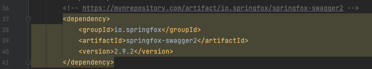
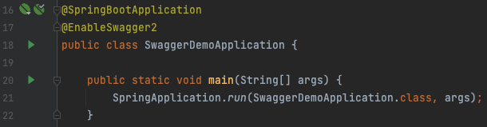
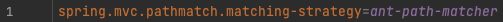
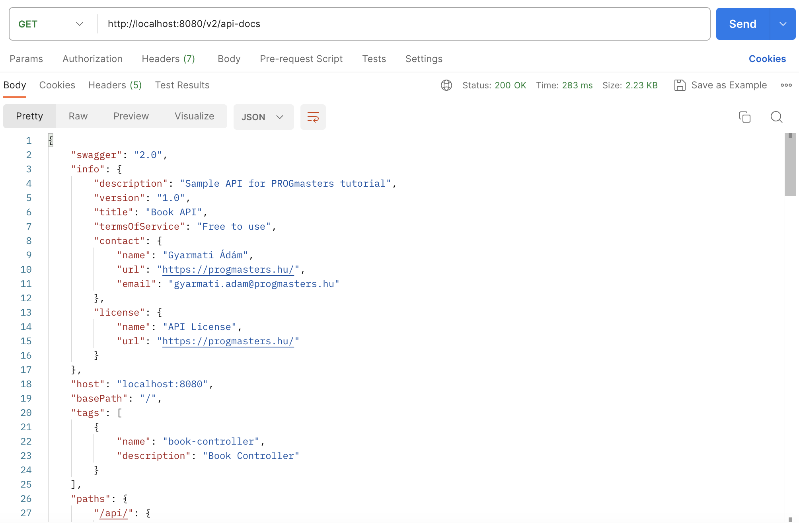
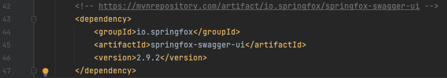
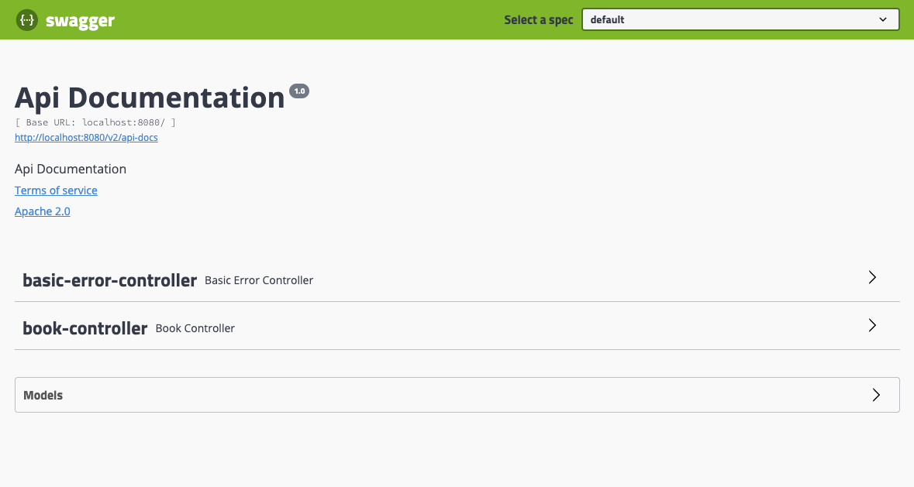
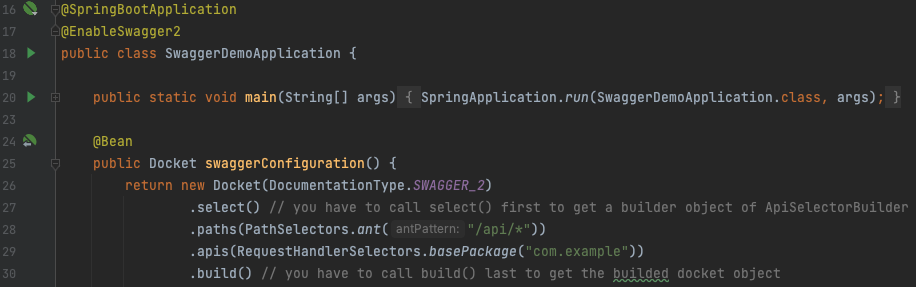
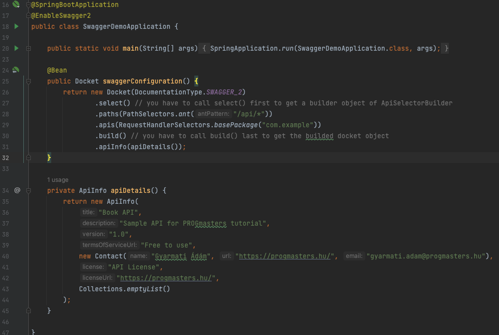
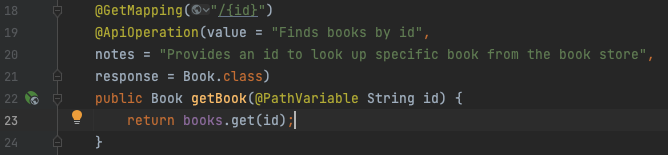
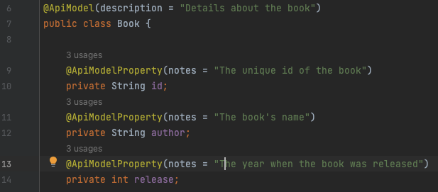

# # Spring Boot with Swagger

### What is Swagger?
Swagger allows you to describe the structure of your APIs so that machines can read them.
The ability of APIs to describe their own structure is the root of all awesomeness in Swagger.
Why is it so great? Well, by reading your API’s structure, we can automatically build beautiful and interactive API documentation. 
We can also automatically generate client libraries for your API in many languages and explore other possibilities like automated testing.
Swagger does this by asking your API to return a YAML or JSON that contains a detailed description of your entire API.
This file is essentially a resource listing of your API which adheres to OpenAPI Specification. The specification asks you to include information like:
* What are all the operations that your API supports?
* What are your API’s parameters and what does it return?
* Does your API need some authorization?
* And even fun things like terms, contact information and license to use the API.

### Let's see how we can add the Swagger to a Spring Boot Application

1. Add the __SpringFox Swagger2__ __2.9.2__ version dependency to the pom.xml
   * 
2. Enable Swagger: in the SwaggerDemoApplication class we have to use the __@EnableSwagger2__ annotation
   * 
3. In the application.properties we have to use the ant path: __spring.mvc.pathmatch.matching-strategy=ant-path-matcher__
   * 
4. Now we can make a get request by postman: http://localhost:8080/v2/api-docs
   * 

### Now we have a documentation about our api endpoints. But there is a better way to use Swagger. That is the __Swagger UI__. Let's see how to implement the UI:
1. Add the __SpringFox Swagger UI__ __2.9.2__ version dependency to the pom.xml
   * 
2. And call the http://localhost:8080/swagger-ui.html in your browser
   * 

### The fun begins here. You can make requests through Swagger UI. You can specify your request, models, etc...Let's see how we can configure the Swagger UI:
1. First we have to create an instance of object, called Docket in SwaggerDemoApplication class.
    * Docket is an object. Contain all the customizable property that you intend for swagger to pick up when it's generating those documentations
    * The way you publish your intent is by making that as a spring bean 
    * 
2. We can configure here the apiInfo as well. 
   * 
3. Adding details to APIs in controllers
   * @ApiOperations
   * 
4. Adding details to model objects
   * @ApiModel
   * @ApiModelProperty
   * 
